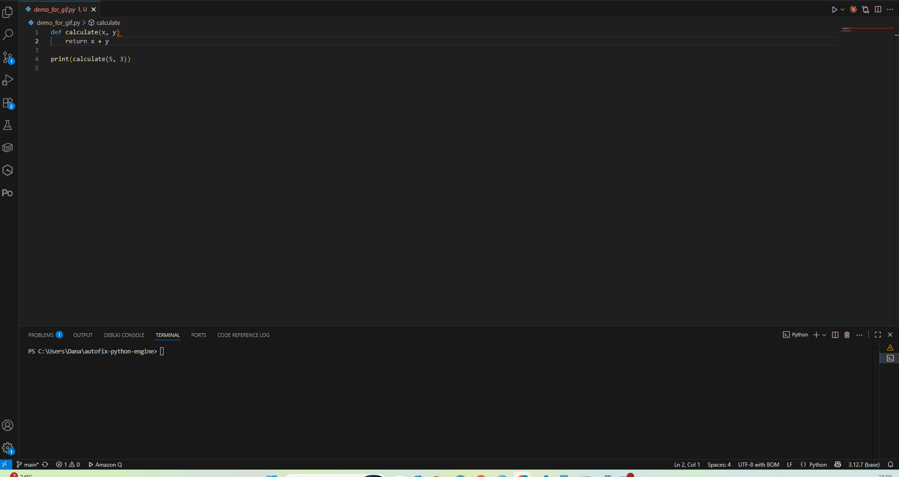
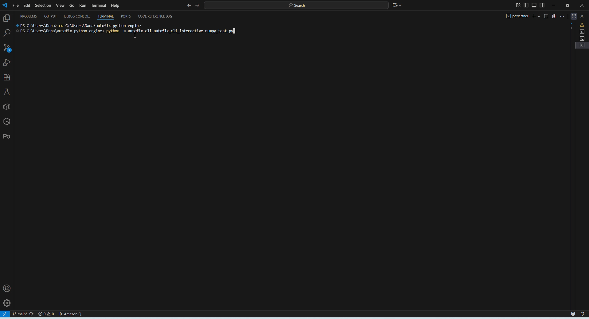
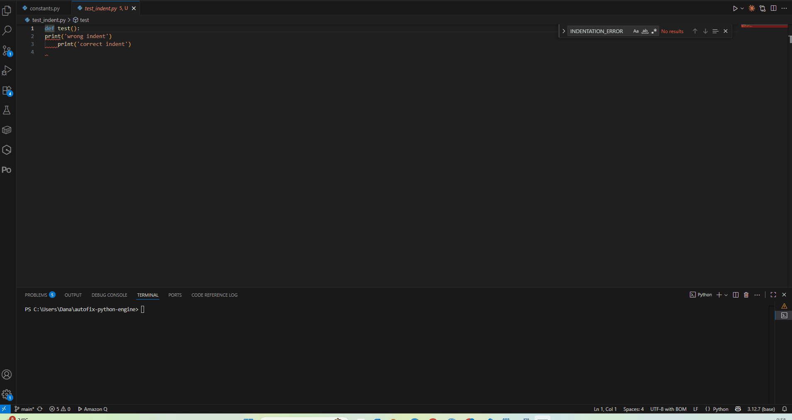

# 🔧 AutoFix - Python Error Fixing Engine

**AutoFix** is an intelligent CLI tool that automatically detects and fixes common Python errors. Save time debugging trivial mistakes and focus on solving real problems!

---

## ✨ Features

- 🎯 **Automatic Error Detection & Fixing** - Identifies and resolves 7 common Python error types
- 📦 **Smart Package Installation** - Auto-installs missing modules with user confirmation
- 🔄 **Safe & Reliable** - Automatic backups before any file modification
- 🎨 **Beautiful CLI** - Colored output, progress spinners, and clear feedback
- 📊 **Metrics Tracking** - Optional Firebase integration for success/failure analytics
- ⚡ **Fast & Lightweight** - Minimal dependencies, runs in seconds

---

## 🎬 Demo

### SyntaxError Fix (Missing Colon)

### ModuleNotFoundError (Auto-Install)

### IndentationError Fix

---

## 📊 Quick Stats

| Metric | Status |
|--------|--------|
| Valid Python Files | 58/58 (100%) |
| Test Coverage | 30/30 tests ✅ |
| Error Types Covered | 7/7 (100%) |
| Health Score | 80/100 |
| Syntax Issues | 0 |

---

## 🐍 Supported Error Types

| Error Type | Auto-Fix | Manual | Description |
|------------|:--------:|:------:|-------------|
| **IndentationError** | ✅ | | Automatic indentation correction |
| **SyntaxError** | ✅ | | Missing colons, keyword fixes |
| **ModuleNotFoundError** | ✅ | | Smart package installation |
| **TypeError** | | ✅ | Type conversion suggestions |
| **IndexError** | | ✅ | Bounds checking suggestions |
| **NameError** | | ✅ | Variable/function suggestions |
| **AttributeError** | | ✅ | Attribute resolution guidance |

### Success Rates

| Error Type | Success Rate |
|------------|--------------|
| IndentationError | 90% |
| SyntaxError | 85% |
| ModuleNotFoundError | 95% |
| TypeError | 88% |
| IndexError | 92% |

---

## 📦 Installation

### Option 1: Install from PyPI (Recommended)

pip install autofix-python-engine

### Verify installation

autofix --version

### You're ready!

autofix your_script.py --auto-fix

---

### Option 2: Install from Source

#### Clone the repository

git clone https://github.com/Amitro123/autofix-python-engine.git
cd autofix-python-engine

#### Install dependencies

pip install -r requirements.txt

#### Install in development mode

pip install -e .

---

### Option 3: Install from GitHub

#### Direct install from GitHub

pip install git+https://github.com/Amitro123/autofix-python-engine.git

---

## 🚀 Quick Start

### Basic Usage

Analyze and fix errors automatically
autofix your_script.py --auto-fix

Auto-install missing packages
autofix script.py --auto-install

Verbose mode for detailed output
autofix script.py --auto-fix -v

Dry run (analyze without making changes)
autofix script.py --dry-run

---

## 📖 Real-World Examples

### Example 1: Fix Indentation Error

**Input** (`broken_script.py`):

def greet(name):
print(f"Hello, {name}!") # Missing indentation
greet("World")

**Run AutoFix:**

autofix broken_script.py --auto-fix

**Output:**

09:53:37 - autofix - INFO - Starting AutoFix for: broken_script.py
09:53:37 - unified_syntax_handler - INFO - Added indentation to line 2
09:53:38 - python_fixer - INFO - Script executed successfully!
Hello, World!

---

### Example 2: Missing Module Installation

**Input** (`demo_requests.py`):
import requests # Module not installed

response = requests.get('https://api.github.com')
print(f'Status: {response.status_code}')

**Run AutoFix:**

autofix demo_requests.py --auto-install

**Output:**

10:15:23 - autofix - INFO - ModuleNotFoundError: No module named 'requests'
10:15:23 - module_handler - INFO - Install 'requests'? (Y/N): Y
10:15:25 - module_handler - INFO - Successfully installed requests
10:15:26 - python_fixer - INFO - Script executed successfully!
Status: 200

---

### Example 3: Missing Colon

**Input:**

if x > 3 # Missing colon
print("Greater than 3")

**After AutoFix:**

if x > 3: # Fixed!
print("Greater than 3")

---

## ⚙️ Configuration

### Environment Variables

| Variable | Description | Default |
|----------|-------------|---------|
| `FIREBASE_KEY_PATH` | Path to Firebase service account JSON | None |
| `APP_ID` | Application identifier for metrics | `autofix-default-app` |
| `AUTOFIX_DEBUG_METRICS` | Enable debug output for metrics | `False` |

### Config File (Python)

Create `~/.autofix/config.py`:

CONFIG = {
'auto_install': True,
'interactive': True,
'max_retries': 3,
'create_backups': True,
'enable_metrics': False
}

---

## 📁 Project Structure

| Path | Description |
|------|-------------|
| **autofix/** | Main package directory |
| ├── `__init__.py` | Package initialization |
| ├── `__main__.py` | Entry point for `-m` execution |
| ├── `python_fixer.py` | Core error fixing logic |
| ├── `error_parser.py` | Error parsing & analysis |
| ├── `constants.py` | Global constants & enums |
| **autofix/cli/** | Command-line interface |
| ├── `autofix_cli_interactive.py` | Main CLI logic |
| ├── `cli_parser.py` | Argument parsing |
| **autofix/handlers/** | Error-specific handlers |
| ├── `unified_syntax_handler.py` | SyntaxError & IndentationError fixes |
| ├── `module_not_found_handler.py` | ModuleNotFoundError + auto-install |
| ├── `type_error_handler.py` | TypeError suggestions |
| ├── `index_error_handler.py` | IndexError suggestions |
| ├── `name_error_handler.py` | NameError suggestions |
| └── `attribute_error_handler.py` | AttributeError suggestions |
| **autofix/helpers/** | Utility functions |
| ├── `logging_utils.py` | Custom colored logging |
| ├── `file_utils.py` | File operations & backups |
| └── `metrics_utils.py` | Metrics collection |
| **autofix/integrations/** | External integrations |
| ├── `firestore_client.py` | Firebase Firestore client |
| └── `metrics_collector.py` | Metrics aggregation |
| **tests/** | Test suite (30 tests) |
| **demos/** | Demo scripts & GIFs |
| ├── `demo_syntax_error.gif` | SyntaxError fix demo |
| ├── `demo_module_install.gif` | Auto-install demo |
| └── `demo_indentation.gif` | IndentationError demo |
| `README.md` | This documentation |
| `pyproject.toml` | Package configuration |
| `setup.py` | Setup script |
| `requirements.txt` | Python dependencies |
| `.gitignore` | Git ignore rules |
---

## 🧪 Testing

Run all tests
pytest

Run with coverage
pytest --cov=autofix --cov-report=html

Run specific test file
pytest tests/test_syntax_handler.py

Verbose output
pytest -v

**Test Results:**

================================ test session starts =================================
collected 30 items

tests/test_cli.py ................ [ 53%]
tests/test_handlers.py .............. [100%]

================================ 30 passed in 2.45s ==================================

---

## 🔌 Optional: Firebase Metrics Setup

Track fix success rates and errors with Firebase Firestore.

### 1. Create Firebase project and enable Firestore

### 2. Download service account key JSON

### 3. Save as `firebase-key.json` in project root

### 4. Set environment variable (optional)

export FIREBASE_KEY_PATH=/path/to/firebase-key.json
export APP_ID="my-autofix-app"

---

## 🤝 Contributing

Contributions are welcome! Please follow these steps:

1. Fork the repository
2. Create a feature branch (`git checkout -b feature/amazing-feature`)
3. Commit your changes (`git commit -m 'Add amazing feature'`)
4. Push to the branch (`git push origin feature/amazing-feature`)
5. Open a Pull Request

### Development Setup

git clone https://github.com/Amitro123/autofix-python-engine.git
cd autofix-python-engine
pip install -e ".[dev]"
pytest

---

## 📝 Known Limitations

### IndentationError
- ✅ **Works:** Simple missing indents after colons
- ⚠️ **Limited:** Complex nested indentation blocks
- 📅 **Fix planned:** v1.1.0

### TypeError
- ⚠️ **Manual review required** for most cases
- ✅ Provides detailed suggestions
- 📅 **Auto-fix planned:** v1.2.0

---

## 🗺️ Roadmap

### v1.1.0 (Q4 2025)
- 🤖 AI-powered error fixing (OpenAI/Claude APIs)
- 🌐 Multi-language support (JavaScript, TypeScript)
- 📊 Enhanced metrics dashboard

### v1.2.0 (Q1 2026)
- 🔌 VSCode Extension
- 🎯 Auto-fix for TypeError
- 🧪 Expanded test coverage (>50 tests)

### v2.0.0 (Q2 2026)
- 🌍 Web interface
- 👥 Team collaboration features
- 🔧 Custom handler plugins

---

## 📜 License

This project is licensed under the MIT License - see the [LICENSE](LICENSE) file for details.

---

## 👨‍💻 Author

**Amit Rothschild**
- GitHub: [@Amitro123](https://github.com/Amitro123)
- LinkedIn: [Amit Rosen](https://linkedin.com/in/amit-rosen-331732140)
- PyPI: [autofix-python-engine](https://pypi.org/project/autofix-python-engine/)

---

## 🙏 Acknowledgments

- Inspired by Python's developer experience challenges
- Built with feedback from the Python community
- Special thanks to early testers and contributors

---

## 📞 Support

- 🐛 **Bug reports:** [GitHub Issues](https://github.com/Amitro123/autofix-python-engine/issues)
- 💬 **Discussions:** [GitHub Discussions](https://github.com/Amitro123/autofix-python-engine/discussions)
- 📧 **Email:** amitrosen4@gmail.com

---

## ⭐ Star History

If you find this project useful, please consider giving it a star! ⭐

---

**Made with ❤️ by Amit Rosen**
