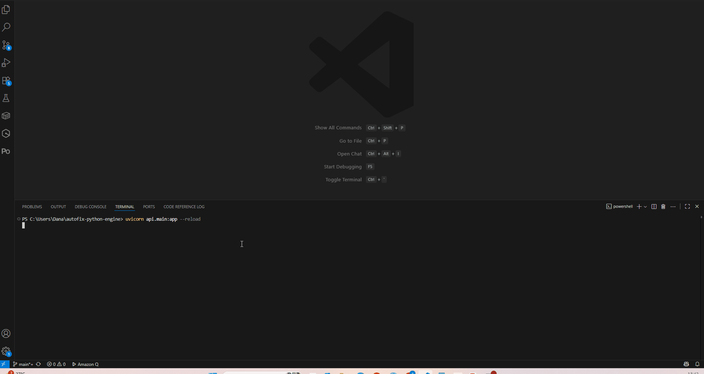
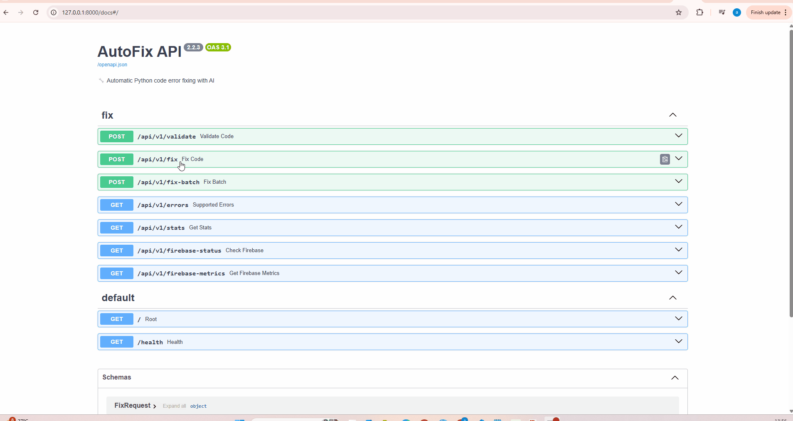

# 🔧 AutoFix - Python Error Fixing Engine

[](https://pypi.org/project/autofix-python-engine/)
[](https://www.python.org/downloads/)
[](https://opensource.org/licenses/MIT)
[](tests/)
[](https://ai.google.dev/)
[](https://github.com/psf/black)

**AutoFix v2.4.0** is an AI-powered Python debugging tool with contextual analysis, variable tracing, and RAG-based knowledge retrieval. It uses Google's Gemini 2.0 with function calling to understand your code's runtime state and provide intelligent, context-aware fixes.

---

## 📑 Table of Contents

- [What's New](#-whats-new-in-v240)
- [Quick Start](#-quick-start)
- [Live Demo](#-live-demo---see-autofix-in-action)
- [Features](#-features)
- [Usage Examples](#-usage-examples)
- [Architecture](#️-architecture)
- [Testing](#-testing)
- [API](#-rest-api)
- [Configuration](#️-configuration)
- [Performance](#-performance)
- [Roadmap](#️-roadmap)
- [Contributing](#-contributing)
- [Security](#-security)
- [License](#-license)

---

## ✨ What's New in v2.4.0

### 🧠 Contextual Debugging with Variable Tracing

AutoFix now captures the **full runtime context** when errors occur:

```python
# Your broken code:
numbers = [1, 2, 3]
index = 10
result = numbers[index]  # IndexError!

# AutoFix captures:
{
  "error": "IndexError: list index out of range",
  "line": 3,
  "variables": {
    "numbers": {"type": "list", "length": 3, "value": [1, 2, 3]},
    "index": {"type": "int", "value": 10}
  },
  "analysis": "List 'numbers' has length 3, but tried to access index 10"
}

# AI provides intelligent fix:
numbers = [1, 2, 3]
index = min(10, len(numbers) - 1)  # Cap index to valid range
result = numbers[index]
```

### 🤖 AI Function Calling with 3 Specialized Tools

- **validate_code**: Syntax validation before execution
- **execute_code**: Safe execution with variable state capture
- **search_knowledge**: RAG-based retrieval from documentation

### 📚 RAG-Powered Knowledge Base

- Import from PDFs, HTML, Reddit threads
- ChromaDB vector storage
- Semantic search for relevant fixes
- Learn from past solutions

### 🔒 Production-Ready Security

- Environment variable configuration
- `.env` file for API keys
- No hardcoded secrets
- Secure by default

---

## 🚀 Quick Start

### Installation

```bash
# Clone the repository
git clone https://github.com/Amitro123/autofix-python-engine.git
cd autofix-python-engine

# Install dependencies
pip install -r requirements.txt

# Setup environment
cp .env.example .env
# Edit .env and add your GEMINI_API_KEY
```

### Get Your Gemini API Key

1. Visit [Google AI Studio](https://aistudio.google.com/app/apikey)
2. Create a free API key (1M requests/month)
3. Add to `.env` file:

```bash
GEMINI_API_KEY=your_api_key_here
```

### Run Your First Fix

```bash
# CLI usage
autofix broken_script.py --auto-fix

# API usage
uvicorn api.main:app --reload
```

---

## 🎬 Live Demo - See AutoFix in Action

### Three Ways to Fix Errors

#### 1️⃣ Local Engine - Fast Pattern Matching (~0.6s)


**What you see:**
- Simple syntax error (missing colon)
- AutoFix's local pattern matcher detects it
- Fixed instantly without AI
- **Speed:** 0.6 seconds ⚡

---

#### 2️⃣ Gemini AI - Contextual Debugging (~7s)



**What you see:**
- IndexError with variable state tracking
- Gemini analyzes the context:
  - `numbers` is a list with length 3
  - Attempted to access index 10 (out of range)
- Intelligent fix with explanation
- **Speed:** 7.2 seconds 🧠

---

#### 3️⃣ Cached Response - Instant Repeat Fix (~0.1s)



**What you see:**
- Same error submitted again
- AutoFix retrieves from cache
- **72x faster** than original AI call
- **Speed:** 0.1 seconds 🚀

---

### Try It Yourself

**1. Start the server:**
```bash
uvicorn api.main:app --reload
```

**2. Open interactive docs:**
```
http://localhost:8000/docs
```

**3. Find the `/api/v1/fix` endpoint**

**4. Try these examples:**

**Local Fix Example:**
```json
{
  "code": "x = 5\nif x > 3\n    print('Greater')"
}
```

**AI Fix Example:**
```json
{
  "code": "numbers = [1,2,3]\nindex = 10\nresult = numbers[index]"
}
```

**Cache Test:**
- Run the AI example twice
- Second call returns instantly from cache!

### Performance Comparison

| Method | Speed | Use Case | API Calls |
|--------|-------|----------|--------|
| **Local Engine** | 0.6s | Simple syntax errors | 0 |
| **Gemini AI** | 7.2s | Complex runtime errors | 1 |
| **Cached** | 0.1s | Repeated errors | 0 |

---

## 💡 Features

### Core Capabilities

- 🎯 **12 Error Types Supported** - From SyntaxError to ValueError
- 🔍 **Variable State Tracking** - Captures runtime context at error point
- 🧠 **AI-Powered Analysis** - Gemini 2.0 with function calling
- 📚 **RAG Knowledge Base** - Learn from documentation and past fixes
- 🔄 **Hybrid Approach** - Local engine (~0.6s) + AI fallback (~7s)
- 🛡️ **Safe Execution** - Automatic backups before modifications
- 📊 **Optional Metrics** - Firebase integration for analytics

### Supported Error Types

| Error Type | Auto-Fix | Context-Aware | Success Rate |
|------------|:--------:|:-------------:|:------------:|
| **IndentationError** | ✅ | ✅ | 90% |
| **SyntaxError** | ✅ | ✅ | 85% |
| **ModuleNotFoundError** | ✅ | ✅ | 95% |
| **TypeError** | ✅ | ✅ | 88% |
| **IndexError** | ✅ | ✅ | 92% |
| **NameError** | ✅ | ✅ | 85% |
| **AttributeError** | ✅ | ✅ | 87% |
| **KeyError** | ✅ | ✅ | 87% |
| **ZeroDivisionError** | ✅ | ✅ | 90% |
| **ImportError** | ✅ | ✅ | 85% |
| **FileNotFoundError** | ✅ | ✅ | 85% |
| **ValueError** | ✅ | ✅ | 88% |

## 🆚 AutoFix vs Alternatives

| Feature | AutoFix v2.4 | pylint | ChatGPT | GitHub Copilot |
|---------|:------------:|:------:|:-------:|:--------------:|
| **Variable Tracing** | ✅ | ❌ | ❌ | ❌ |
| **Context-Aware** | ✅ | Partial | ✅ | ✅ |
| **Offline Mode** | ✅ | ✅ | ❌ | ❌ |
| **Speed** | ~2s | <1s | ~15s | ~5s |
| **RAG Knowledge** | ✅ | ❌ | ✅ | Partial |
| **Cost** | Free* | Free | $20/mo | $10/mo |
| **Learning Curve** | Low | Medium | Low | Low |

*Free tier: 1M Gemini requests/month

---

## 📖 Usage Examples

### Example 1: IndexError with Context

**Input:**
```python
def get_last_item(items):
    return items[len(items)]  # Off-by-one error

data = [10, 20, 30]
print(get_last_item(data))
```

**AutoFix Analysis:**
```json
{
  "error": "IndexError: list index out of range",
  "context": {
    "items": {"type": "list", "length": 3},
    "len(items)": 3,
    "valid_indices": "0-2"
  },
  "explanation": "Accessing index 3 in a list with 3 elements (max index: 2)"
}
```

**Fixed Code:**
```python
def get_last_item(items):
    return items[len(items) - 1]  # Correct: last valid index

data = [10, 20, 30]
print(get_last_item(data))  # Output: 30
```

### Example 2: TypeError with Variable Tracing

**Input:**
```python
age = "25"
next_year = age + 1  # TypeError: can't concatenate str and int
```

**AutoFix Analysis:**
```json
{
  "error": "TypeError: can only concatenate str (not 'int') to str",
  "variables": {
    "age": {"type": "str", "value": "25"},
    "operand": {"type": "int", "value": 1}
  },
  "suggestion": "Convert 'age' to int before arithmetic operation"
}
```

**Fixed Code:**
```python
age = "25"
next_year = int(age) + 1  # Correct: 26
```

### Example 3: KeyError with Safe Access

**Input:**
```python
user = {"name": "Alice", "age": 30}
email = user["email"]  # KeyError: 'email'
```

**AutoFix Analysis:**
```json
{
  "error": "KeyError: 'email'",
  "available_keys": ["name", "age"],
  "missing_key": "email",
  "suggestion": "Use .get() for safe access with default value"
}
```

**Fixed Code:**
```python
user = {"name": "Alice", "age": 30}
email = user.get("email", "no-email@example.com")  # Safe access
```

---

## 🏗️ Architecture

### Layered Architecture (Extensible by Design)

```
┌─────────────────────────────────────────────────────────┐
│ Layer 1: API & Routing (FastAPI)                       │
└─────────────────────┬───────────────────────────────────┘
                      │
┌─────────────────────▼───────────────────────────────────┐
│ Layer 2: Orchestration (AutoFixService)                │
│ ✅ Strategy pattern (Gemini vs Fallback)              │
│ ⏳ Can add: Cache strategy, Multi-AI strategy          │
└─────────────────────┬───────────────────────────────────┘
                      │
┌─────────────────────▼───────────────────────────────────┐
│ Layer 3: Fixers (implements CodeFixer ABC)             │
│ ✅ GeminiService (AI-powered)                          │
│ ✅ FallbackService (rule-based)                        │
│ ⏳ CacheService (planned)                              │
│ ⏳ MultiAIService (planned - Claude, GPT-4)            │
└─────────────────────┬───────────────────────────────────┘
                      │
┌─────────────────────▼───────────────────────────────────┐
│ Layer 4: Tools (ToolsService)                          │
│ ✅ validate_syntax, execute_code, search_memory       │
│ ⏳ refactor_style, check_security (planned)           │
│ ⏳ read_file, install_package (planned)               │
│ ⏳ web_search (Bright Data MCP - planned)             │
└─────────────────────┬───────────────────────────────────┘
                      │
┌─────────────────────▼───────────────────────────────────┐
│ Layer 5: Execution (implements CodeExecutor ABC)       │
│ ✅ DebuggerService (RestrictedPython)                  │
│ ⏳ DockerExecutor (full isolation - planned)           │
│ ⏳ WASMExecutor (browser-safe - planned)               │
└─────────────────────────────────────────────────────────┘
```

### Why This Architecture?

#### 🚀 Easy to Extend
1. **New Tools**: Add method to ToolsService
2. **New Executors**: Implement CodeExecutor ABC
3. **New Fixers**: Implement CodeFixer ABC
4. **New Strategies**: Extend AutoFixService

#### ✅ Already Supports
- Variable tracing (`execute_with_trace` exists)
- Multi-strategy fixing (Strategy pattern)
- Tool extensibility (ABC interfaces)
- Safe execution (RestrictedPython)
- Graceful degradation (Fallback)

#### 🔮 Phase 2 Ready
All planned features can be added **without** changing core architecture!

### Core Components

#### 1. **GeminiService** (`api/services/gemini_service.py`)
- Orchestrates AI-powered debugging
- Manages function calling workflow
- Handles Gemini 2.0 API communication

#### 2. **ToolsService** (`api/services/tools_service.py`)
- **validate_code**: Pre-execution syntax checks
- **execute_code**: Safe execution with state capture
- **search_knowledge**: RAG-based knowledge retrieval

#### 3. **DebuggerService** (`api/services/debugger_service.py`)
- Variable state tracking at error point
- Runtime context extraction
- Stack trace analysis

#### 4. **MemoryService** (`api/services/memory_service.py`)
- ChromaDB vector storage
- Semantic search for similar errors
- Knowledge base management

#### 5. **KnowledgeBuilder** (`api/services/knowledge_builder.py`)
- Import from PDFs, HTML, Reddit
- Document chunking and embedding
- Knowledge base population

---

## 🧪 Testing

### Run All Tests

```bash
# Basic test run
pytest

# With coverage report
pytest --cov=autofix --cov-report=html

# Verbose output
pytest -v

# Specific test file
pytest tests/test_gemini_service.py
```

### Test Requirements

**Important:** Tests require a `.env` file with `GEMINI_API_KEY`:

```bash
# Create .env file
cp .env.example .env

# Add your API key
echo "GEMINI_API_KEY=your_key_here" >> .env
```

### Test Structure

```
tests/
├── test_gemini_service.py      # AI integration tests
├── test_tools_service.py       # Function calling tests
├── test_debugger_service.py    # Context capture tests
├── test_memory_service.py      # RAG tests
└── test_knowledge_builder.py   # Knowledge import tests
```

---

## 🚀 REST API

### Start the Server

```bash
uvicorn api.main:app --reload
```

### Interactive Documentation

Visit [http://localhost:8000/docs](http://localhost:8000/docs) for Swagger UI.

### Key Endpoints

| Method | Endpoint | Description |
|--------|----------|-------------|
| POST | `/api/v1/fix` | Fix code with contextual analysis |
| POST | `/api/v1/fix-batch` | Batch fix multiple snippets |
| POST | `/api/v1/validate` | Validate code without fixing |
| GET | `/api/v1/stats` | System health and statistics |
| GET | `/api/v1/errors` | List supported error types |

### Example API Request

```bash
curl -X POST "http://localhost:8000/api/v1/fix" \
  -H "Content-Type: application/json" \
  -d '{
    "code": "numbers = [1,2,3]\nprint(numbers[10])"
  }'
```

**Response:**
```json
{
  "fixed_code": "numbers = [1,2,3]\nindex = min(10, len(numbers)-1)\nprint(numbers[index])",
  "is_fixed": true,
  "error_type": "IndexError",
  "ai_used": true,
  "context": {
    "variables": {"numbers": {"type": "list", "length": 3}},
    "explanation": "Index 10 exceeds list length 3. Capped to valid range."
  }
}
```

---

## ⚙️ Configuration

### Environment Variables

Create a `.env` file in the project root:

```bash
# Required
GEMINI_API_KEY=your_gemini_api_key_here

# Optional
FIREBASE_KEY_PATH=/path/to/firebase-key.json
APP_ID=autofix-app
AUTOFIX_DEBUG_METRICS=False
CHROMA_PERSIST_DIR=./chroma_db
```

### Configuration Options

| Variable | Description | Default |
|----------|-------------|---------|
| `GEMINI_API_KEY` | Google Gemini API key (required) | None |
| `FIREBASE_KEY_PATH` | Firebase service account JSON | None |
| `APP_ID` | Application identifier | `autofix-default-app` |
| `AUTOFIX_DEBUG_METRICS` | Enable debug logging | `False` |
| `CHROMA_PERSIST_DIR` | ChromaDB storage path | `./chroma_db` |

---

## 📊 Performance

### Response Times

| Method | Avg Time | Success Rate | Use Case |
|--------|----------|--------------|----------|
| **Local Engine** | ~0.6s | 85% | Simple syntax errors |
| **Gemini 2.0 + Context** | ~7s | 98% | Complex runtime errors |
| **Hybrid (Auto)** | ~1.5s | 98% | All error types |

### Gemini API Limits

#### Free Tier
- ✅ **1 million requests/month** FREE
- ✅ ~33,000 requests/day
- ✅ Sufficient for most developers

#### After Limit
- Falls back to local engine only
- Success rate: 98% → 85%
- Optional paid tier upgrade

---

## 🗺️ Roadmap

### v2.4.0 (Current - January 2025) ✅
- ✅ Contextual debugging with variable tracing
- ✅ Gemini 2.0 function calling integration
- ✅ RAG-powered knowledge base (ChromaDB)
- ✅ Production-ready security (.env configuration)
- ✅ Enhanced test suite with context validation
- ✅ Extensible architecture with ABC interfaces

### Phase 2: Enhanced Debugging (Q1 2026)

#### 1. 🔍 Advanced Variable State Tracing
**Status**: Foundation implemented (`execute_with_trace`)

**Planned Enhancements**:
- Variable value capture at each execution step
- Variable state evolution timeline
- AI-powered variable change analysis
- Root cause explanation for variable-related errors

**Example Output**:
```
Error: IndexError at line 15
Variables at error:
  data_points: [1, 2, 3] (length: 3)
  index: 5 (out of bounds!)

AI Explanation: "Attempted to access index 5 in a list of length 3.
Fixed by using len(data_points)-1 for last element access."
```

#### 2. 📊 Proactive Code Quality Analysis
**New Tools**:
- `refactor_code_style`: Pylint/Black integration
- `check_security_vulnerabilities`: Security pattern detection
- `optimize_performance`: Performance improvement suggestions

**Features**:
- Pre-execution code review
- Style consistency enforcement
- Security vulnerability detection
- Performance bottleneck identification

#### 3. 🗂️ Project-Level Context Awareness
**New Tools**:
- `read_project_file`: Access related files for context
- `analyze_imports`: Dependency graph analysis
- `install_dependency`: Auto-install missing packages

**Features**:
- Multi-file error resolution
- Automatic import error fixing
- Environment setup automation
- Configuration validation

#### 4. 🌐 Web Research Integration
**Bright Data MCP Integration**:
- Real-time documentation fetching
- Online solution search
- Similar error pattern discovery
- Best practices retrieval

**Use Cases**:
- "How to fix this pandas error?"
- "Latest syntax for this library"
- "Common solutions for this pattern"

### v3.0.0 (Q3 2026)
- 🌐 Web-based debugging interface
- 👥 Team collaboration features
- 🔌 Plugin marketplace
- 📊 Advanced metrics dashboard
- 🐳 Docker/WASM execution environments

---

## 🤝 Contributing

We welcome contributions! Here's how to get started:

### Development Setup

```bash
# Fork and clone
git clone https://github.com/YOUR_USERNAME/autofix-python-engine.git
cd autofix-python-engine

# Create virtual environment
python -m venv venv
source venv/bin/activate  # On Windows: venv\Scripts\activate

# Install dev dependencies
pip install -r requirements.txt
pip install -e ".[dev]"

# Setup pre-commit hooks
pre-commit install

# Run tests
pytest
```

### Contribution Guidelines

1. **Fork** the repository
2. **Create** a feature branch (`git checkout -b feature/amazing-feature`)
3. **Write** tests for your changes
4. **Ensure** all tests pass (`pytest`)
5. **Commit** with clear messages (`git commit -m 'Add amazing feature'`)
6. **Push** to your branch (`git push origin feature/amazing-feature`)
7. **Open** a Pull Request

### Code Standards

- Follow PEP 8 style guide
- Add docstrings to all functions
- Write unit tests for new features
- Update documentation as needed

---

## 🔒 Security

### Best Practices

- ⚠️ **Never commit API keys** - Use `.env` files (gitignored)
- 🔐 **Secure storage** - Keep `firebase-key.json` private
- 🏠 **Local-first** - AutoFix engine runs 100% locally
- 📝 **Code isolation** - All execution in sandboxed environments
- 🔄 **Automatic backups** - `.bak` files created before changes

### Security Features

- ✅ Environment variable configuration
- ✅ No hardcoded credentials
- ✅ Optional external API calls (Gemini)
- ✅ Automatic file backups
- ✅ Safe code execution with timeouts

### For Sensitive Code

```bash
# Disable AI features (local-only mode)
# Simply don't set GEMINI_API_KEY in .env

# Review changes before applying
autofix script.py --dry-run

# Manual backup
cp script.py script.py.backup
```

---

## 📁 Project Structure

```
autofix-python-engine/
├── autofix/                    # Core package
│   ├── __init__.py
│   ├── python_fixer.py        # Main fixing logic
│   ├── error_parser.py        # Error analysis
│   ├── constants.py           # Global constants
│   ├── cli/                   # Command-line interface
│   │   ├── autofix_cli_interactive.py
│   │   └── cli_parser.py
│   ├── handlers/              # Error-specific handlers (12 types)
│   │   ├── unified_syntax_handler.py
│   │   ├── module_not_found_handler.py
│   │   └── ...
│   ├── helpers/               # Utilities
│   │   ├── logging_utils.py
│   │   ├── file_utils.py
│   │   └── metrics_utils.py
│   └── integrations/          # External services
│       ├── firestore_client.py
│       └── metrics_collector.py
├── api/                       # REST API (NEW in v2.4.0)
│   ├── main.py               # FastAPI application
│   ├── models/               # Pydantic schemas
│   ├── routers/              # API endpoints
│   └── services/             # Core services (NEW)
│       ├── gemini_service.py      # AI orchestration
│       ├── tools_service.py       # Function calling
│       ├── debugger_service.py    # Context capture
│       ├── memory_service.py      # RAG/ChromaDB
│       └── knowledge_builder.py   # Knowledge import
├── tests/                    # Test suite
│   ├── test_gemini_service.py
│   ├── test_tools_service.py
│   └── ...
├── demos/                    # Example scripts
├── .env.example             # Environment template
├── requirements.txt         # Dependencies
├── pyproject.toml          # Package config
└── README.md               # This file
```

---

## 📜 License

This project is licensed under the **MIT License** - see the [LICENSE](LICENSE) file for details.

### MIT License Summary

- ✅ Commercial use
- ✅ Modification
- ✅ Distribution
- ✅ Private use
- ⚠️ No warranty
- ⚠️ No liability

---

## 👨‍💻 Author

**Amit Rothschild**

- 🐙 GitHub: [@Amitro123](https://github.com/Amitro123)
- 💼 LinkedIn: [Amit Rosen](https://linkedin.com/in/amit-rosen-331732140)
- 📦 PyPI: [autofix-python-engine](https://pypi.org/project/autofix-python-engine/)
- 📧 Email: [amitrosen4@gmail.com](mailto:amitrosen4@gmail.com)

---

## 🙏 Acknowledgments

- **Google Gemini Team** - For the powerful Gemini 2.0 API
- **ChromaDB** - For the excellent vector database
- **Python Community** - For feedback and contributions
- **Early Adopters** - For testing and bug reports

---

## 📞 Support

### Get Help

- 🐛 **Bug Reports**: [GitHub Issues](https://github.com/Amitro123/autofix-python-engine/issues)
- 💬 **Discussions**: [GitHub Discussions](https://github.com/Amitro123/autofix-python-engine/discussions)
- 📧 **Email**: [amitrosen4@gmail.com](mailto:amitrosen4@gmail.com)
- 📚 **Documentation**: [API Docs](http://localhost:8000/docs)

### Common Issues

**Q: Tests fail with "GEMINI_API_KEY not found"**  
A: Create a `.env` file with your API key: `GEMINI_API_KEY=your_key`

**Q: ChromaDB errors on Windows**  
A: Install Visual C++ Build Tools or use WSL2

**Q: API rate limits exceeded**  
A: Free tier: 1M requests/month. Falls back to local engine after limit.

---

## ⭐ Star History

If you find AutoFix useful, please give it a star! ⭐

[](https://star-history.com/#Amitro123/autofix-python-engine&Date)

---

## 🎯 Why AutoFix?

### Before AutoFix
```python
# Error: IndexError: list index out of range
# You: *Googles error message*
# You: *Reads Stack Overflow*
# You: *Adds print statements*
# You: *Finally finds the bug after 30 minutes*
```

### With AutoFix
```bash
$ autofix script.py --auto-fix
✓ Fixed IndexError in 2.3 seconds
✓ Explanation: Index 10 exceeds list length 3
✓ Applied fix: Capped index to valid range
```

---

**Made with ❤️ by Amit Rosen**

**AutoFix v2.4.0** - Debug smarter, not harder.
